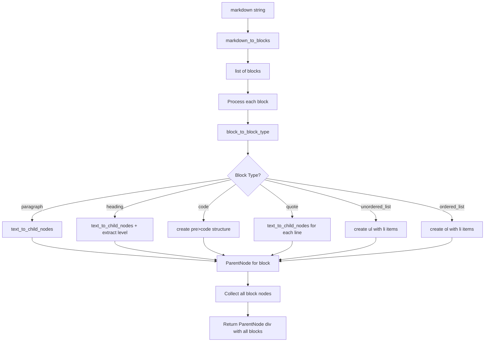

# Plan: `markdown_to_html_node` Function

## Overview

Create a function that converts a complete markdown document into a single parent [`HTMLNode`](../src/htmlnode.py:1) with nested child nodes representing the document structure.

## Context

The project already has:
- [`HTMLNode`](../src/htmlnode.py:1), [`LeafNode`](../src/htmlnode.py:36), and [`ParentNode`](../src/htmlnode.py:59) classes
- [`markdown_to_blocks`](../src/utils.py:214) - splits markdown into block-level sections
- [`block_to_block_type`](../src/utils.py:16) - identifies block types (heading, paragraph, code, quote, list)
- [`text_to_textnodes`](../src/utils.py:198) - converts inline markdown to TextNodes
- [`text_node_to_html_node`](../src/utils.py:55) - converts TextNode to HTMLNode

## Function Signature

```python
def markdown_to_html_node(markdown):
    """
    Converts a markdown document into a single parent HTMLNode.
    
    Args:
        markdown: String containing markdown document
        
    Returns:
        ParentNode with tag='div' containing child nodes for each block
    """
```

## High-Level Flow



## Pseudocode

```
function markdown_to_html_node(markdown):
    # Split markdown into blocks
    blocks = markdown_to_blocks(markdown)
    
    # Create list to hold child nodes for each block
    block_children = []
    
    # Process each block
    for block in blocks:
        # Determine block type
        block_type = block_to_block_type(block)
        
        # Convert block to HTMLNode based on type
        if block_type == PARAGRAPH:
            child_node = paragraph_to_html_node(block)
        elif block_type == HEADING:
            child_node = heading_to_html_node(block)
        elif block_type == CODE:
            child_node = code_to_html_node(block)
        elif block_type == QUOTE:
            child_node = quote_to_html_node(block)
        elif block_type == UNORDERED_LIST:
            child_node = unordered_list_to_html_node(block)
        elif block_type == ORDERED_LIST:
            child_node = ordered_list_to_html_node(block)
        
        block_children.append(child_node)
    
    # Return parent div containing all blocks
    return ParentNode("div", block_children)


function text_to_child_nodes(text):
    # Convert text with inline markdown to list of HTMLNodes
    text_nodes = text_to_textnodes(text)
    children = []
    for text_node in text_nodes:
        html_node = text_node_to_html_node(text_node)
        children.append(html_node)
    return children


function paragraph_to_html_node(block):
    # Process inline markdown in paragraph
    children = text_to_child_nodes(block)
    return ParentNode("p", children)


function heading_to_html_node(block):
    # Extract heading level (count # chars)
    level = count_leading_hashes(block)
    
    # Remove "### " prefix to get text
    text = strip_heading_prefix(block)
    
    # Process inline markdown
    children = text_to_child_nodes(text)
    
    # Return h1-h6 tag
    return ParentNode(f"h{level}", children)


function code_to_html_node(block):
    # Remove ``` delimiters
    code_text = strip_code_delimiters(block)
    
    # Code blocks should not process inline markdown
    # Just wrap text in code tag, then in pre tag
    code_node = LeafNode("code", code_text)
    return ParentNode("pre", [code_node])


function quote_to_html_node(block):
    # Split into lines
    lines = split_into_lines(block)
    
    # Strip '>' from each line and join
    text = join_lines_without_prefix(lines, ">")
    
    # Process inline markdown in quote
    children = text_to_child_nodes(text)
    
    return ParentNode("blockquote", children)


function unordered_list_to_html_node(block):
    # Split into lines
    lines = split_into_lines(block)
    
    # Create list items
    list_items = []
    for line in lines:
        # Strip "* " or "- " prefix
        text = strip_list_prefix(line)
        
        # Process inline markdown in list item
        children = text_to_child_nodes(text)
        
        li_node = ParentNode("li", children)
        list_items.append(li_node)
    
    return ParentNode("ul", list_items)


function ordered_list_to_html_node(block):
    # Split into lines
    lines = split_into_lines(block)
    
    # Create list items
    list_items = []
    for line in lines:
        # Strip "1. ", "2. ", etc. prefix
        text = strip_numbered_prefix(line)
        
        # Process inline markdown in list item
        children = text_to_child_nodes(text)
        
        li_node = ParentNode("li", children)
        list_items.append(li_node)
    
    return ParentNode("ol", list_items)
```

## Helper Functions Needed

These small utility functions will simplify the implementation:

1. `text_to_child_nodes(text)` - Convert inline markdown to list of HTMLNodes
2. `paragraph_to_html_node(block)` - Create `<p>` node
3. `heading_to_html_node(block)` - Create `<h1>`-`<h6>` node
4. `code_to_html_node(block)` - Create `<pre><code>` structure
5. `quote_to_html_node(block)` - Create `<blockquote>` node
6. `unordered_list_to_html_node(block)` - Create `<ul>` with `<li>` items
7. `ordered_list_to_html_node(block)` - Create `<ol>` with `<li>` items

## Test Structure

Tests should cover:

### Function Tests (`test_markdown_to_html_node.py`)
- [x] Empty markdown document → empty div
- [x] Single paragraph → div with single p tag
- [x] Multiple paragraphs → div with multiple p tags
- [x] Heading conversion → proper h1-h6 tags with correct level
- [x] Code block → pre>code structure with no inline processing
- [x] Quote block → blockquote tag
- [x] Unordered list → ul with multiple li tags
- [x] Ordered list → ol with multiple li tags
- [x] Mixed content → all block types in one document
- [x] Inline markdown in blocks → bold, italic, code, links, images work correctly
- [x] Multi-line quote → joins lines properly
- [x] Multi-line list items → each item is separate li

### Helper Function Tests (`test_block_to_html_helpers.py`)
- [x] `text_to_child_nodes` converts inline markdown correctly
- [x] `paragraph_to_html_node` creates p tag with inline content
- [x] `heading_to_html_node` extracts level and text correctly
- [x] `code_to_html_node` preserves raw text without inline processing
- [x] `quote_to_html_node` strips > prefix and processes inline markdown
- [x] `unordered_list_to_html_node` strips * or - prefix
- [x] `ordered_list_to_html_node` strips numbered prefix

## Implementation Notes

- All block-level nodes should be returned as `ParentNode` objects
- Inline content should use existing `text_to_textnodes` → `text_node_to_html_node` pipeline
- Code blocks should NOT process inline markdown (keep raw text)
- Quote and list content SHOULD process inline markdown
- The main function returns a `ParentNode` with `tag="div"` containing all block nodes
